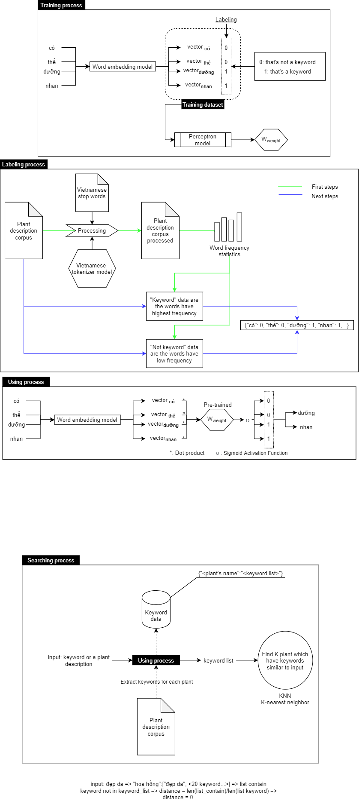

# How to run project

## Step 1: Working in statistics_words folder
 - Run the file convert json2txt to build the data corpus
 - Let start processing your corpus with pre_process file (pre: previously) 
 - Now, run the statistics_words.js to see how often each word is repeated

## Step 2: Switch to working in build_vecs folder, and don't forget copy your data has processed to using in there
 - Run the create_onehot.js
 - Run the create_window.js
 - Run index.js for training
(If you don't know how it work or how to use it, please go to https://www.npmjs.com/package/nk-vector for checking)

## Step 3: Let start training your Extract keywords model at train_extract_keywords model. As above, don't forget copy your data vecs, list keywords (positive) and list not keywords (negative) file from prev-steps.
 - Run create_data_train_extract.js to get your data train and data y_train (label of each word's vector)
 - Run the train.js to build your W (Weight for predicting)
 - Run the index.js to test your W
(If you confusing where I build the file has the name contain "50d", it is also the data vecs has been built by another kind of [NK-VEC](https://viblo.asia/p/word-embedding-gioi-thieu-y-tuong-mo-hinh-nhung-tu-moi-mot-mo-hinh-moi-ho-tro-xu-ly-cac-bai-toan-nlp-voi-nodejs-V3m5WvdvlO7) that is still similar to your NK-VEC version, I just want to test new algorithm.). The data vector had been built by [NK-VECTOR](https://www.npmjs.com/package/nk-vector)

## Step 4: You can skip if you don't want to build the previous extract keywords for each plant. I create it for searching with const-databse (don't update if the user want to add a new plant)
 - Copy everyfile such as positive, negative files, the data vecs and your W to here
 - Run index.js

## Step 5: You also skip if you skip step 4
 - Type your keyword in sentence variable
 - Node index.js to show your results of plant searching

## Step 6: Run as API
 - Everything in here is similar to step 5.

# Diagrams

Follow the flow of each diagram in this picture if you want to understand this project

P/s: The word statistics only give you an overview of your magnetic pocket. It will help you more conveniently recognize which words are keywords. It does NOT give you exactly where the keyword is!